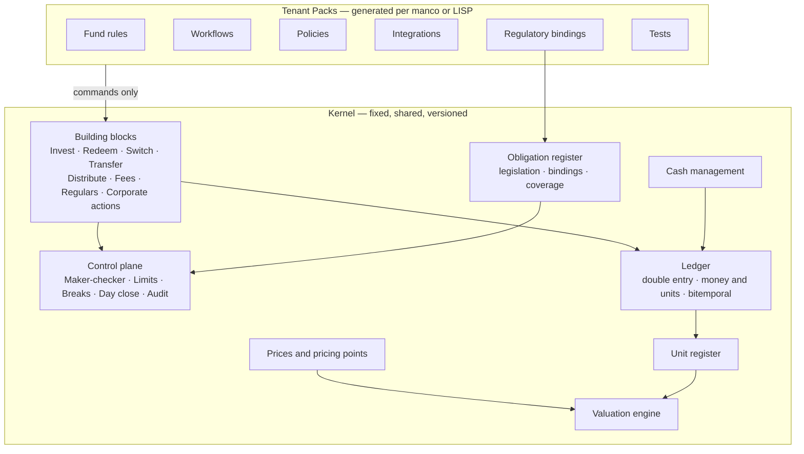
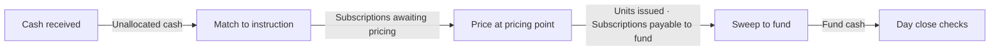

# 2. Architecture

## Two layers

- The **kernel** is one codebase. Every tenant runs the same kernel version.
- A **pack** is one tenant's implementation. It is generated, versioned and pinned.
- Packs issue **kernel commands only**. They cannot post to the ledger, write the register or move cash directly.

## Kernel components

| Component | Responsibility | Fixed behaviour |
|-----------|----------------|-----------------|
| **Ledger** | Double-entry journal in two dimensions: money per currency, units per class. Bitemporal. Immutable. | Unbalanced journals are rejected. Corrections are reversals plus re-posts. |
| **Unit register** | Positions per account and class, derived from unit postings. Units in issue per class. | Σ holdings + box = units in issue. Checked on every unit journal. |
| **Prices** | Price series per class and pricing point. Versions for corrections. Official and indicative kinds. | Published prices are never overwritten. A correction is a new version. |
| **Valuation** | Pure functions: units × selected price, with provenance. | No value is stored as a fact. |
| **Building blocks** | Investment, redemption, switch, transfer, distribution, fees, regular instructions, corporate actions, backdating, corrections. | Each block has a fixed contract, fixed postings and fixed control accounts. |
| **Cash management** | Bank accounts, statements, matching, payables, payments, settlement, bank reconciliation. | No payment without a payable. No units without a cash fact or an explicit exposure posting. |
| **Control plane** | Maker-checker, segregation of duties, limits, exceptions, breaks, day close, audit trail. | Maker ≠ checker. Day close blocks on open breaks above tolerance. |
| **Party and account** | Investors, advisers, nominees, KYC status, bank details, accounts. | Bank detail changes are controlled events. |
| **Queries** | As-at views on both time axes, with a price policy. | Every value carries its price basis. |
| **Obligation register** | The legislation library and each tenant's bindings: FSR Act, COFI, FAIS, CISCA, FICA, POPIA and more. Coverage gate, obligation tags on commands, compliance calendar. Doc 13. | A pack cannot be released with an unbound in-force obligation. Library changes need two approvers. |

## Tenant Pack contents

| Part | Examples |
|------|----------|
| **Fund rules** | Classes, calendars, cut-offs, pricing points, minimums, fee schedules, distribution policy, ring-fencing thresholds, settlement terms, rounding. |
| **Workflows** | Intake channels, validation steps, holds, approval tiers, exception routing, communications. |
| **Policies** | Units-on-cleared-funds, backdating and loss allocation, pricing error handling, approval limits (tighter than kernel), retention. |
| **Integrations** | Bank file formats, FinSwitch mappings, fund accounting feed, SARS, FIC, statement templates. |
| **Regulatory bindings** | `regulatory/obligations.yaml` and the compliance calendar. Every rule names the obligations it serves. Doc 13. |
| **Tests** | Scenario tests in domain language with expected postings. Golden files from the shadow run. |

A pack is a set of **declarative, typed files** in the Pack DSL (doc 09). It runs in a **sandbox** with no I/O of its own.

## How blocks connect

Blocks never call each other. Each block:

1. Accepts a **command**. Typed, idempotent, with actor, tenant, pack version and evidence.
2. Checks **kernel preconditions**, then **pack guards**. A pack may only add conditions.
3. Posts **exactly one balanced journal** and emits events.
4. Leaves value in a **control account** that the next block consumes.

Every arrow is a **control account** with an owner, an expected clearing time and a tolerance. Doc 05 lists them all.

## Commands and queries

**Commands** are block operations. Examples: `ReceiveInstruction`, `MatchCash`, `PriceDeals`, `ApprovePayment`, `DeclareDistribution`, `ApproveBackdating`.

**Queries** are as-at views. Every query takes:

- `effectiveAsAt` — the business date.
- `knowledgeAsAt` — what was known at that time. Default: now.
- `pricePolicy` — `official-latest`, `indicative-latest`, or a specific pricing point.

The response carries **price date, version and age** for every value.

## Time model

| Term | Meaning |
|------|---------|
| **Received at** | Server timestamp when an instruction arrived. Immutable. |
| **Cut-off** | Pack rule per class. Decides the dealing date from received-at. |
| **Dealing date / effective date** | The business date a deal belongs to. |
| **Pricing point** | The valuation time for a dealing date. For example 15:00 on the JSE calendar. |
| **Posted at / knowledge date** | When the kernel recorded the fact. |
| **Day close** | Locks a dealing date. Later effective postings into it are backdating by definition. |

Time zone is **Africa/Johannesburg**. Calendars come from the pack: JSE, bank, fund specific.

## Runtime shape

- **Event store** as the system of record for ledger and register events.
- **Projections** for reads. They are caches. A test proves each projection equals a pure recompute.
- **Deterministic sandbox** for packs, for example WebAssembly. Fixed CPU and memory budget. No network, no clock, no randomness. The kernel passes time in.
- **Adapters** for banks, FinSwitch, fund accounting, SARS and FIC. Adapters translate. They do not decide.
- **Control plane** services: approvals, limits, breaks, day close.
- **Pack service**: generation, validation, simulation, review, release.
- **Fixed-point decimals** everywhere. No floating point in money or units.
- **Data residency** in South Africa. Tenant isolation at the data layer.

## What is deliberately not a setting

| Not configurable | Why |
|------------------|-----|
| Double entry in money and units | Otherwise a block can create value from nothing. |
| Bitemporal storage | Otherwise backdating rewrites history. |
| Immutability of postings and prices | Otherwise the audit trail lies. |
| Loss owner on every delta | Otherwise the fund absorbs errors silently. |
| Maker ≠ checker | Otherwise one person can move money alone. |
| Day close gates | Otherwise breaks roll forever. |
