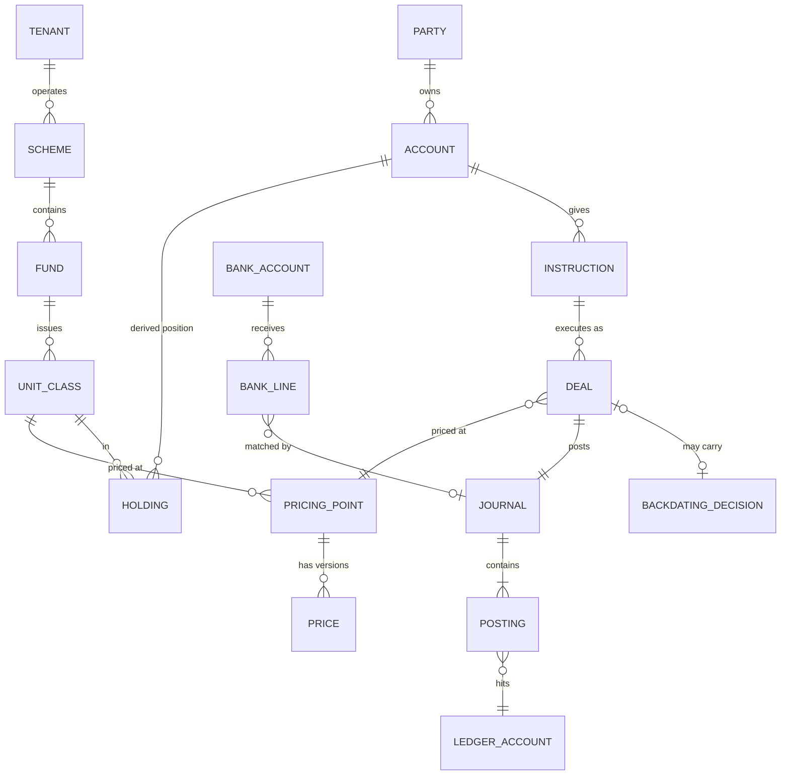

# 3. Domain model

## Entities

### Tenants and parties

| Entity | Notes |
|--------|-------|
| **Tenant** | A manco, a LISP, or both. Runs one pinned pack version. |
| **Party** | Investor (natural or juristic), adviser or FSP, nominee (LISP), the manco itself, a fund (for its own cash), SARS, a bank. |
| **KYC status** | FICA verified, pending, expired. A kernel flag with controlled transitions. |
| **Bank details** | Verified beneficiary accounts. A change is a controlled event with a cooling-off flag. |

### Products and instruments

| Entity | Notes |
|--------|-------|
| **Scheme** | A collective investment scheme under a deed. |
| **Fund (portfolio)** | A portfolio in a scheme. |
| **Unit class** | The priced instrument. A, B, C classes with different fees. Has an ISIN. |
| **External class** | LISP tenants only. A class priced by another manco. |
| **Model portfolio** | A recipe of classes with target weights. LISP only. |
| **Account** | An investor's holding container. Has a **product type**: discretionary, TFSA, RA, preservation, living annuity, endowment. Product rules live in the pack. |
| **Component** | A sub-position inside an account, for example the two-pot components. Pack defined. Kernel enforces separate unit balances. |

### Instructions and deals

| Entity | Notes |
|--------|-------|
| **Instruction** | An intent from a party: invest, redeem, switch, transfer, change option, regular instruction. Immutable received-at. Evidence attached. |
| **Deal** | An execution of an instruction against a class at a pricing point. Units = amount ÷ price, or amount = units × price. |
| **Pricing point** | Class + dealing date + valuation time. The unit of pricing. |
| **Price** | Official NAV or indicative, in cents per unit, with a **version** and a published-at time. |
| **Backdating decision** | Reason, fault party, loss owner account, approvals, computed delta. |

### Ledger and cash

| Entity | Notes |
|--------|-------|
| **Ledger account** | A chart entry per tenant, fund or class. Money accounts and unit accounts. |
| **Journal** | A balanced set of postings with effective date, posted at, actor, command id, pack version. |
| **Posting** | A debit or credit in money (currency) or units (class). |
| **Bank account** | A segregated trust account, a fee account, or a custodian settlement account. |
| **Bank line** | A statement line. Matched to an expectation or parked in unallocated cash. |
| **Payable / receivable** | Redemptions payable, distributions payable, fees payable, subscriptions receivable. |
| **Payment** | An instruction to a bank. Batched, approved, confirmed or returned. |

### Distributions and fees

| Entity | Notes |
|--------|-------|
| **Distribution declaration** | Class, period, cents per unit, tax components, record date, pay date. |
| **Entitlement** | Derived: units at record date × cents per unit. Paid out or reinvested. |
| **Fee claim** | A pack-calculated amount. The kernel executes it as a unit cancellation or a cash deduction. |

### Controls

| Entity | Notes |
|--------|-------|
| **Approval** | Role, actor, timestamp, on a command. Maker ≠ checker. |
| **Break** | A reconciliation difference with owner, age and tolerance. |
| **Exception** | A workflow hold with reason and SLA. |
| **Day close** | Per tenant and dealing date. Locks effective postings. |
| **Audit event** | Append-only. Command, actor, pack version, evidence. |

## Relationships

`HOLDING` is not a table. It is a **derived position**: the fold of unit postings for an account and a class.

## Kernel invariants

These hold for every tenant, every pack, every day.

| # | Invariant |
|---|-----------|
| **I1** | Every journal balances in money per currency **and** in units per class. |
| **I2** | Σ investor holdings + box holdings = units in issue, per class, at every knowledge time. |
| **I3** | Units are issued or cancelled only by a deal at a price in a pricing point. |
| **I4** | Every deal has a cash fact (bank line or settlement) or an explicit **settlement exposure** posting within a limit. |
| **I5** | Postings are immutable. A correction is a reversal plus a new posting, with a reason. |
| **I6** | No monetary value of a position is stored as a fact. Caches carry price version and as-at. |
| **I7** | A backdated or reversed deal carries a **loss owner** account and a **delta posting**. |
| **I8** | No payment without a payable. No payable without cancelled units, a declared distribution or an executed fee claim. |
| **I9** | Maker ≠ checker on every controlled transition. |
| **I10** | A price correction never overwrites. It creates a version and triggers the correction block. |
| **I11** | A closed dealing date accepts effective postings only through the backdating block. |
| **I12** | Every command records actor, evidence and pack version. |

## Precision and rounding

- **Units**: the pack declares decimals, commonly 4. The kernel enforces explicit rounding per deal.
- **Prices**: cents per unit. The pack declares decimals, commonly 2 or 4.
- **Money**: currency minor units.
- Rounding differences post to a **rounding account** with a tolerance. Reconciled daily.

## Unit account convention

Unit accounts follow register practice.

- **Holder accounts** (investor holding, locked holding, box) carry **credit** balances.
- The **units-in-issue control** carries the matching **debit** balance.
- A unit journal balances when both sides move by the same quantity. This is invariant I2 by construction.

## Glossary

| Term | Meaning |
|------|---------|
| **Manco** | CIS management company under CISCA. |
| **CIS** | Collective investment scheme. A unit trust. |
| **LISP** | Linked investment service provider. Holds funds across mancos in a nominee. |
| **cpu** | Cents per unit. The SA price convention. |
| **Forward pricing** | Deals are priced at the next pricing point after receipt. Required under CISCA. |
| **Pricing point** | The daily valuation time for a class. |
| **In good order** | An instruction with all documents and FICA complete. |
| **Ring-fencing** | Deferral of large repurchases to protect remaining investors. |
| **Box** | Manco-owned units used to smooth dealing. |
| **MDD** | Minimum disclosure document. The fund fact sheet. |
| **FinSwitch** | The SA industry switch for LISP-to-manco instructions, prices and confirmations. |
| **Two-pot** | Retirement fund components: vested, savings, retirement. |
