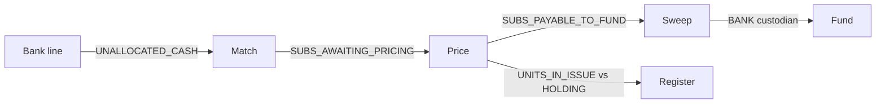
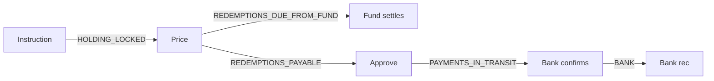

# 5. Financial controls

## The rule

> **There is a control account between every two blocks.**

A block never hands value to the next block directly. It posts into a control account. The next block draws from it. The balance of that account is a fact anyone can inspect, age and reconcile.

If a block fails halfway, the value is visible in the control account. Nothing is in limbo.

## Two flows, end to end

### Investment chain

### Redemption chain

## Control account register

| Account | Fed by | Cleared by | Expected clearing | Break when | Owner |
|---------|--------|------------|-------------------|------------|-------|
| `UNALLOCATED_CASH` | Bank lines with no match | Match or refund | Pack SLA, commonly 1–2 business days | Balance older than SLA | Cash team |
| `SUBS_AWAITING_PRICING` | Matched cash | Pricing | Next pricing point | Non-zero after pricing | Dealing |
| `SUBS_PAYABLE_TO_FUND` | Priced investments | Sweep to custodian | Settlement terms | Non-zero after sweep | Finance |
| `SETTLEMENT_EXPOSURE` | Units before cleared funds | Cash receipt or reversal | Instrument clearing time | Over pack limit, or aged | Finance |
| `REDEMPTIONS_DUE_FROM_FUND` | Priced redemptions | Fund settlement | T+1 to T+3 | Non-zero after terms | Finance |
| `REDEMPTIONS_PAYABLE` | Priced redemptions | Payment confirmation | Settlement terms | Unpaid beyond terms | Payments |
| `PAYMENTS_IN_TRANSIT` | Instructed payments | Bank confirmation | Same or next day | Unconfirmed beyond a day | Payments |
| `SWITCH_CLEARING` | Out legs | In legs | In-leg pricing date | Non-zero after in leg | Dealing |
| `DISTRIBUTIONS_PAYABLE` | Declarations | Pay-out or reinvest | Pay date | Non-zero after pay date | Operations |
| `FEES_PAYABLE:*` | Executed fee claims | Fee payment | Fee cycle | Non-zero after payment | Finance |
| `TAX_WITHHELD_PAYABLE` | Deals and distributions | SARS remittance | Statutory date | Non-zero after remittance | Tax |
| `MANCO_ERROR_ACCOUNT` | Deltas the manco owns | Manco funding or recovery | Monthly review | Any unapproved entry | Finance and Head of Ops |
| `INTERMEDIARY_ACCOUNT:*` | Deltas owned by a LISP or adviser | Invoice and recovery | 30 days | Aged | Finance |
| `FUND_DILUTION_ACCOUNT` | Deltas the deed lets the fund absorb | Trustee reporting | Monthly | Over pack cap | Compliance |
| `ROUNDING` | Deal and distribution rounding | Periodic clearance | Monthly | Over tolerance | Finance |
| `INTEREST_ON_TRUST_CASH` | Bank interest | Allocation per policy | Monthly | Non-zero after allocation | Finance |

The pack can **tighten** any clearing time, tolerance or owner. It cannot remove an account from the register.

## Controls catalogue

### C1. Double entry in two dimensions

Every journal balances in **money per currency** and in **units per class**. A deal that issues units must show where the cash or exposure came from. A deal that cancels units must show where the cash goes.

### C2. Bitemporal ledger

Every posting has an **effective date** and a **posted-at** time. Every balance can be asked "as at effective date E, as known at time K". Backdating never rewrites a view that was already reported.

### C3. Immutability

No update. No delete. A correction is a **reversal journal** plus a new journal. Both reference each other and carry a reason.

### C4. Maker-checker and segregation of duties

The kernel enforces **maker ≠ checker** on every controlled transition. Roles are separated: capture, authorise, release payment, reconcile.

Minimum approvals the kernel demands. The pack may require more.

| Transition | Kernel minimum |
|------------|----------------|
| Bank detail change | 1 checker, cooling-off flag raised |
| Manual price entry or override | 2 signers |
| Official price publication | 2 signers |
| Backdating decision | 2 approvers, neither the maker |
| Reversal of a priced deal | 2 approvers |
| Payment release | Pack tiers must cover every amount, 1 checker minimum |
| Fee override | 2 approvers |
| FICA status override | 2 approvers |
| Pack version activation | 2 platform approvers plus tenant sign-off |
| Reopening a closed day | Not allowed. Use backdating. |

### C5. Limits

Per-user and per-role monetary limits. Velocity limits. Large transaction flags for FIC reporting. Exposure limits on `SETTLEMENT_EXPOSURE` per fund and per tenant.

### C6. Reconciliations

| Reconciliation | Cadence | Compares | Tolerance | Owner |
|----------------|---------|----------|-----------|-------|
| Register vs fund accounting | Daily | Units in issue per class, per knowledge date | Zero | Dealing |
| Bank | Daily and intraday | Bank statements vs `BANK:*` accounts | Zero, timing items listed | Cash team |
| Control account ageing | Daily | Every control account vs its clearing rule | Per register above | Account owner |
| Nominee bulk (external classes) | Daily | Σ investor holdings + rounding vs the issuing manco's statement per class | Zero | Dealing |
| Price sanity | Per publication | New price vs previous official and latest indicative | Pack tolerance | Pricing |
| Distribution | Per declaration | Declared total vs Σ entitlements | Rounding only | Operations |
| Payments | Per batch | Payables vs bank file vs confirmations | Zero | Payments |
| Fee run | Per cycle | Claims vs cancellations vs payments | Zero | Finance |

Every difference becomes a **break** with an owner, an age and a tolerance. Breaks do not disappear. They are resolved with a reason.

### C7. Exceptions and breaks

One queue. Every item has an owner, an SLA and an escalation path. A period cannot close with open breaks above tolerance.

### C8. Day close

The gates in doc 04 lock the effective date. After the lock, effective postings into that date go only through the backdating block, with its approvals and its delta posting.

### C9. Audit and provenance

Append-only events. Every command records the actor, the evidence, and the **pack version** that decided. For a generated rule the pack carries the source document and paragraph. An auditor can trace a fee from the investor statement to the deed.

### C10. Packs tighten only

A pack may lower a limit, add an approver, shorten a clearing time, add a gate. A pack can never raise a kernel limit, remove an approver, extend a clearing time or skip a gate. The pack validator rejects any attempt.

### C11. Regulatory coverage

Every kernel control names the obligations it serves. Every applicable in-force obligation is bound to a kernel control, a pack rule or an attested manual procedure. A pack cannot be released otherwise. A command records the obligations it evaluated. Doc 13.

| Control | Serves, among others |
|---------|----------------------|
| C1 double entry | CISCA trust money and unit register duties |
| C2 bitemporal ledger | FSR Act and FICA record keeping, CISCA reporting |
| C3 immutability | FICA and FAIS record keeping, POPIA integrity |
| C4 maker-checker | FSR Act governance, FICA risk management and compliance programme |
| C5 limits | FICA threshold reporting, Regulation 28, exchange control |
| C6 reconciliations | CISCA trustee reporting, FSR Act returns |
| C8 day close | CISCA daily pricing and dealing duties |
| C9 audit and provenance | FSR Act information requests, COFI conduct evidence |

## Control matrix

| Boundary | C1 | C2 | C3 | C4 | C5 | C6 | C8 |
|----------|----|----|----|----|----|----|----|
| Bank line → match | ✔ | ✔ | ✔ | | ✔ | ✔ | ✔ |
| Match → price | ✔ | ✔ | ✔ | | | ✔ | ✔ |
| Price → units | ✔ | ✔ | ✔ | ✔ | | ✔ | ✔ |
| Units → fund settlement | ✔ | ✔ | ✔ | | | ✔ | ✔ |
| Payable → payment | ✔ | ✔ | ✔ | ✔ | ✔ | ✔ | ✔ |
| Any → backdating | ✔ | ✔ | ✔ | ✔ | ✔ | ✔ | ✔ |
| Price → correction | ✔ | ✔ | ✔ | ✔ | | ✔ | ✔ |

## What "solid building block" means here

A block is solid when:

1. Its postings are the same for every tenant.
2. Its control accounts are the same for every tenant.
3. Its invariants are tested once, in the kernel, with property tests.
4. Its reversal is defined.
5. A pack can only make it stricter.
