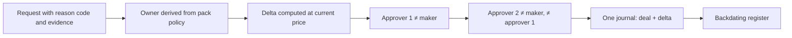

# 7. Backdating and corrections

## Definitions

| Term | Meaning |
|------|---------|
| **Received at** | When the instruction arrived. Immutable. |
| **Dealing date** | The date the deal should belong to, by the cut-off rule. |
| **Current pricing point** | The next price not yet published. |
| **Backdating** | Processing a deal at a pricing point whose price is **already published** and already used for other deals. |
| **Delta** | The money difference between the historical price and the current price on that deal. |
| **Loss owner** | The ledger account that takes the delta. |

## Why it happens

- The manco captured late. Manco error.
- A system outage delayed processing.
- A LISP or adviser sent late and asks for the earlier date under an SLA.
- An instruction was held for FICA or documents and the manco chooses to honour the original date.
- A debit order was collected, units issued, and the collection was later unpaid.
- A payment was returned.
- A published price was wrong.

## The rule

> **The fund always deals at the current price. A named owner pays for the historical price.**

Forward pricing protects the other investors in the fund. A backdated deal must not dilute them. So the fund receives or pays value at today's NAV. The investor is dealt at the historical price. The difference is a **delta**, posted to the loss owner. Never to the fund by default.

## The formula

Historical price **P_h**. Current price **P_c**. Amount **A**. Units **U**.

**Backdated investment**

```
U       = A ÷ P_h                     units the investor receives
fund    = U × P_c                     what the fund must receive today
delta   = U × P_c − A = A × (P_c ÷ P_h − 1)
```

- delta > 0: price rose. The owner **pays** the fund the delta.
- delta < 0: price fell. The fund needs less than A. The surplus goes **to the owner**.

**Backdated redemption**

```
investor = U × P_h                    what the investor is paid
fund     = U × P_c                    what the fund pays out today
delta    = U × (P_h − P_c)
```

- delta > 0: price fell. The owner **pays** the investor the shortfall.
- delta < 0: price rose. The fund pays more than the investor gets. The surplus goes **to the owner**.

## Worked examples

**Investment.** A = R100 000. P_h = R10.00 (1 000.00 cpu). P_c = R10.50.

```
U     = 10 000 units
fund  = R105 000
delta = +R5 000  → Dr MANCO_ERROR_ACCOUNT 5 000 · Cr SUBS_PAYABLE_TO_FUND 5 000
```

Same deal with P_c = R9.50:

```
fund  = R95 000
delta = −R5 000  → Dr SUBS_PAYABLE_TO_FUND is reduced; Cr MANCO_ERROR_ACCOUNT 5 000
```

**Redemption.** U = 10 000. P_h = R10.00. P_c = R10.50.

```
investor = R100 000
fund     = R105 000
delta    = −R5 000 → the R5 000 surplus is credited to MANCO_ERROR_ACCOUNT
```

With P_c = R9.50 the fund pays R95 000, the investor gets R100 000, the owner pays R5 000.

## Postings

A backdated investment posts one journal with effective date = historical dealing date.

| Money | Units |
|-------|-------|
| Dr `SUBS_AWAITING_PRICING` A | Dr `UNITS_IN_ISSUE` U |
| Dr or Cr `<loss owner>` delta | Cr `HOLDING` U |
| Cr `SUBS_PAYABLE_TO_FUND` U × P_c | |

The journal is unbalanced without the delta line. The kernel rejects it. That is invariant **I7** in one sentence: **you cannot backdate without naming who pays.**

## Loss allocation matrix

The pack supplies the owner per reason. The kernel demands that every reason has one.

| Cause | Backdate? | Delta owner | Approvals |
|-------|-----------|-------------|-----------|
| Manco captured late | Yes, to the original dealing date | `MANCO_ERROR_ACCOUNT` | Ops manager + Finance |
| System outage | Yes | `MANCO_ERROR_ACCOUNT` | Ops manager + Finance |
| Price published late (T+1 pricing) | Not backdating. The deal waits for its price. | None | Automatic |
| LISP or adviser late, SLA allows | Yes, if the manco accepts | `INTERMEDIARY_ACCOUNT:<party>` | Head of Ops + intermediary acknowledgement |
| LISP or adviser late, no SLA | No. Next pricing point. | None | Automatic |
| Investor not in good order | No. Dealing date = in-good-order date. | None | Automatic |
| Debit order unpaid after units issued | Reversal at the current price | `MANCO_ERROR_ACCOUNT` | Automatic, reported daily |
| Returned payment | No price effect. Back to payable, exception raised. | None | Payments |
| Wrong published price, material | Reprice affected deals | `MANCO_ERROR_ACCOUNT` compensates investors and fund | Pricing committee, trustee informed |
| Wrong published price, below materiality | Per pack policy, often no investor correction | `MANCO_ERROR_ACCOUNT` or `FUND_DILUTION_ACCOUNT` | Pricing committee |
| Deed allows the fund to absorb | Yes, within a cap | `FUND_DILUTION_ACCOUNT` | Compliance, trustee report |

## The workflow



- The owner comes from policy. An approver can move the delta to a **more conservative** owner, for example from fund dilution to manco error. Never the other way.
- The register lists every backdated deal with reason, owner, delta, approvers and evidence. It goes to Finance daily and to the trustee monthly.
- Backdating older than the pack's maximum age is refused.

## Reversals

A reversal is a **new deal at the current price plus a delta**. Never a deletion.

**Unpaid debit order.** R1 000 collected, 100 units issued at R10.00 under `SETTLEMENT_EXPOSURE`. Unpaid five days later. Price now R9.80.

```
cancel 100 units at R9.80  → fund returns R980
exposure was R1 000
delta = −R20              → MANCO_ERROR_ACCOUNT bears R20
```

At R10.20 the fund returns R1 020 and the R20 gain is credited to the owner account. The investor never had cleared money and receives nothing either way.

**Duplicate deal.** Reverse at the current price. Delta to the owner per reason code.

## Price corrections

A wrong official price is a **new version** of the price. The old version stays. The correction block then:

1. Finds every deal priced on version 1.
2. Computes each deal's correct units or cash on version 2.
3. Applies materiality from the pack policy, aligned to the ASISA pricing error standard.
4. Above materiality: posts correction deals. Buyers get units adjusted or cash. Sellers get a top-up. The fund is compensated for dilution. All from `MANCO_ERROR_ACCOUNT`.
5. Below materiality: applies the pack policy. Often no investor correction. Fund compensation optional.
6. Produces a pricing error report for the pricing committee and the trustee.

**Example.** Published 1 000.00 cpu. Correct 1 007.00 cpu. Error 0.7%, above a 0.5% materiality. A buyer of R100 000 received 10 000 units and should have received 9 930.4866. The excess 69.5134 units are cancelled at the corrected price, or the manco pays the fund for them. A seller of 10 000 units received R100 000 and was due R100 700. The manco pays R700.

## Bitemporal consequences

- A statement sent before the backdating still exists and can be reproduced.
- The regenerated statement shows the deal on its historical date.
- The published NAV for that date is **not restated**. It used the units in issue known at the pricing time.
- Register versus fund accounting reconciles **per knowledge date**. The backdated units appear in both from the posting time onward.

## Kernel guarantees

1. No effective posting into a closed date except through this block.
2. No backdated or reversed deal without a loss owner and a delta line.
3. The fund side always uses the current price.
4. Two approvers, both different from the maker.
5. Every backdated deal is in the register with its evidence.
6. Price corrections version, never overwrite.
