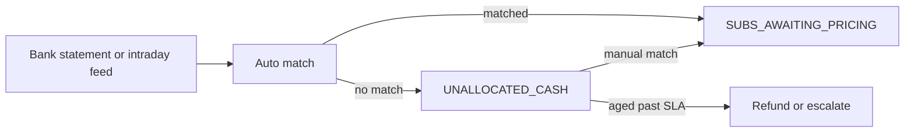
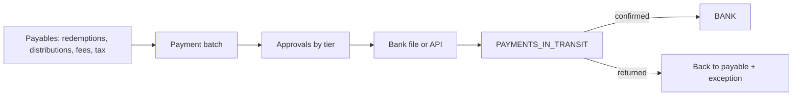

# 8. Cash management

## Bank account model

| Account type | Holds | Owner |
|--------------|-------|-------|
| **Trust account** | Investor money before it reaches the fund and after it leaves | Manco or LISP, segregated as CISCA requires |
| **Custodian settlement account** | The fund's own cash | Fund, at the trustee or custodian |
| **Fee account** | Collected fees | Manco, adviser payments flow out |
| **Tax account** | Withheld tax pending remittance | Manco |

Every bank account maps to a `BANK:<account>` ledger account. A bank line is a fact. Its match to a ledger expectation is a posting.

## Money in



- Matching keys: reference, amount, payer account, expected receipt from an instruction or a collection.
- The pack can add matching heuristics. The kernel owns the match posting and the unmatched queue.
- **Unallocated cash ages.** Past the pack SLA it is a break with an owner.
- **Cleared funds.** EFT clears in one to two days. Debit orders carry a dispute window. Instant payments clear at once.

### Units-on policy

The pack chooses, per channel, when units are issued:

| Policy | Effect |
|--------|--------|
| **On cleared funds** | Cash is a fact before units exist. No exposure. |
| **On receipt** | Units at the pricing point after the bank line. `SETTLEMENT_EXPOSURE` until cleared. |
| **On collection day** | Debit orders. Units on the collection date. `SETTLEMENT_EXPOSURE` until the dispute window closes. |

The kernel caps `SETTLEMENT_EXPOSURE` per fund and per tenant. Over the cap, no new exposure. An unpaid item after units were issued is a reversal with a loss owner. Doc 07.

## Money out



- **No payment without a payable.** The payable exists only after units were cancelled, a distribution was declared, or a fee claim executed.
- **Beneficiary verification** before first payment and after any bank detail change. Account verification service where available.
- **Approval tiers** by amount. The pack defines them. The kernel requires that tiers cover every amount and that maker ≠ checker.
- **Payment batches** carry the list of payables. The file total equals the batch total equals the payables total.
- **Returns** move the amount back to the payable and open an exception. They never vanish.

## Settlement with the fund

Each dealing day, per fund:

```
net settlement = subscriptions priced − redemptions priced ± switches ± distributions reinvested − fees
```

- Net or gross settlement per fund is a pack choice. Both post the same control accounts.
- Settlement terms per class come from the pack. T+0 to T+3.
- `SUBS_PAYABLE_TO_FUND` and `REDEMPTIONS_DUE_FROM_FUND` clear on settlement.

**Cash forecast for the portfolio manager.** Priced deals plus unpriced deals valued at the last known price. Available after cut-off. A view, not a stored number. It feeds liquidity decisions and ring-fencing.

## Interest on trust cash

Trust accounts earn interest. The pack says who receives it: investors pro rata, the fund, or the manco under the deed. The kernel tracks it through `INTEREST_ON_TRUST_CASH` and posts the allocation. It is never left in the bank account unexplained.

## Bank reconciliation

- Daily, with intraday feeds where the bank offers them.
- Every bank line is matched to a ledger posting or listed as a break with an age.
- Timing items are named: payments in transit, receipts in clearing.
- The reconciliation is a report over facts. Nothing is adjusted to make it balance.

## Controls specific to cash

| Control | Rule |
|---------|------|
| Segregation | Trust money never mixes with manco money. Separate bank accounts, separate ledger accounts. |
| Dual authorisation | Every payment release has a maker and a checker. Higher tiers add approvers. |
| Limits | Per user, per role, per batch. Velocity limits on new beneficiaries. |
| No payment without payable | Kernel invariant I8. |
| FICA before pay-out | Redemption payments require current FICA status. |
| Cooling-off | A bank detail change flags the account. The pack sets the period. Payments in the period need an extra approver. |
| Ageing | Unallocated cash, unconfirmed payments and open returns age into breaks. |
| Exposure cap | `SETTLEMENT_EXPOSURE` limits per fund and per tenant. |

## Integration points

- Bank statements: MT940, CAMT.053, bank APIs.
- Collections: DebiCheck authenticated collections and EFT debit orders.
- Payments: bank host-to-host or API with confirmations and returns.
- Beneficiary verification: account verification service.

Adapters translate formats. Every decision stays in the kernel and the pack.
