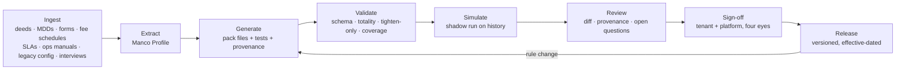

# 9. Tenant Packs, AI generated

## What a pack is

A **Tenant Pack** is one manco's or LISP's complete implementation on top of the kernel.

| Part | Contents |
|------|----------|
| `funds/` | Every fund and class: calendars, cut-offs, pricing points, minimums, fees, distributions, ring-fencing, settlement, rounding. |
| `workflows/` | State machines for each instruction type: steps, guards, holds, approval tiers, communications. |
| `policies/` | Units-on policy, backdating and loss allocation, pricing errors, approval limits, retention. |
| `integrations/` | Bank formats, FinSwitch mappings, fund accounting feed, SARS and FIC outputs, templates. |
| `tests/` | Scenario tests in domain language with expected postings. Golden files from the shadow run. |
| `regulatory/` | The obligation register: bindings for FSR Act, COFI, FAIS, CISCA, FICA, POPIA and more, plus the compliance calendar. Doc 13. |
| `provenance/` | For every rule, the source document, section and quote. |

A pack is **generated**, then **reviewed**, then **released** as a version. The kernel stamps the pack version on every command and journal.

## Generated versus configured

| | Configuration (incumbents) | Generated pack |
|-|----------------------------|----------------|
| Where behaviour lives | Thousands of parameters read by one generic engine | Explicit rules in a small typed language |
| Can you read it | Only by knowing how settings interact | Yes. One file per fund, one per workflow |
| Can you test it | End-to-end, by hand | Scenario tests generated with the rules, run in CI |
| Can you diff a change | A settings export | A code diff with a test diff |
| Provenance | None | Every rule cites its source paragraph |
| Can a control be switched off | Yes, by a setting | No. The kernel owns controls. Packs tighten only |
| Time to onboard | Months to years | Weeks: generate, simulate, review, release |

## The Pack DSL

Design rules for the language:

1. **Declarative and typed.** Money, Units, Percent, Bps, Date, Time, Calendar are distinct types. Rounding is explicit.
2. **Total.** No unbounded loops. No recursion. Every expression terminates.
3. **Deterministic.** No clock, no randomness, no network. The kernel passes time and prices in.
4. **Kernel commands only.** The pack cannot post, cannot write the register, cannot touch a bank.
5. **Tighten only.** Any limit, approval or gate in a pack is validated against the kernel minimum.
6. **Effective-dated.** Every rule has an effective-from date. Old versions remain readable.
7. **Provenance required.** A rule without a source is a validation error, unless marked as a documented assumption.

### Shape of a fund rule

```yaml
fund: EXB
class: EXB-A
effective_from: 2026-10-01
pricing:
  calendar: JSE
  point: "15:00"
  publish_by: "T+1 08:00"
  decimals: { price_cpu: 2, units: 4 }
dealing:
  cutoff: "14:00"
  settlement: { subscription: T+0, redemption: T+2 }
minimums:
  lump_sum: R10 000
  additional: R1 000
  debit_order: R500
fees:
  initial: { max: 3.45%, negotiable_by: adviser, vat: included }
  adviser_ongoing: { max: 1.15%, method: unit_cancellation, frequency: monthly }
distributions:
  frequency: quarterly
  default: reinvest
  reinvest_price: ex_distribution
ring_fencing:
  threshold: 5% of fund NAV per dealing day
  approver: head_of_ops
source:
  - { doc: "Supplemental Deed EXB (2021)", section: "4.2", quote: "…" }
```

### Shape of a workflow

```yaml
workflow: redemption
states: [captured, validated, held, priced, approved, paid, closed, rejected]
transitions:
  - from: captured
    to: validated
    guard: kernel.in_good_order and pack.bank_details_stable(days: 30)
  - from: captured
    to: held
    when: not pack.bank_details_stable(days: 30)
    task: { name: verify_bank_details, role: ops_verifier }
  - from: validated
    to: priced
    on: kernel.PricePublished
  - from: priced
    to: approved
    approvals:
      - when: amount > R1 000 000
        roles: [ops_manager, finance_manager]
      - otherwise:
        roles: [ops_manager]
  - from: approved
    to: paid
    on: kernel.PaymentConfirmed
```

### Shape of a policy

```yaml
policy: backdating
max_age_days: 30
reasons:
  manco_error:      { owner: MANCO_ERROR_ACCOUNT, approvals: [ops_manager, finance] }
  system_outage:    { owner: MANCO_ERROR_ACCOUNT, approvals: [ops_manager, finance] }
  sla_intermediary: { owner: INTERMEDIARY_ACCOUNT, approvals: [head_of_ops], requires: intermediary_ack }
  investor_late:    { allowed: false }
report: daily
```

### Shape of a test

```yaml
scenario: redemption over one million needs two approvers
given:
  - holding: { account: ACC-1, class: EXB-A, units: 100 000 }
  - price:   { class: EXB-A, date: 2026-10-05, cpu: 1 500.00 }
when:
  - redeem: { account: ACC-1, class: EXB-A, units: 80 000, received: "2026-10-05 10:00" }
then:
  - approvals_required: [ops_manager, finance_manager]
  - postings:
      - { account: REDEMPTIONS_PAYABLE, credit: R1 200 000.00 }
      - { account: UNITS_IN_ISSUE:EXB-A, debit_units: 80 000 }
```

The full example lives in `docs/examples/example-manco-pack/`.

## The generation pipeline



### Ingest

Everything the manco already has. Deeds and supplemental deeds. MDDs. Application forms. Fee schedules. LISP SLAs. Operating procedures. The legacy system's configuration export. Sample transactions and statements. Interview transcripts.

### Extract

A structured **Manco Profile**: funds, classes, calendars, cut-offs, minimums, fees, distribution policy, channels, approvals, exceptions, communications, backdating policy, settlement terms, ring-fencing, reporting duties. Each item with a source and a confidence.

### Generate

The model writes the pack files. Each rule carries `source:`. Each ambiguity becomes an **open question**, for example: "The deed says 14:00 cut-off. The ops manual says 13:30 for fax. Which applies to email?"

The model also writes the tests: one scenario per rule, plus edge cases the kernel knows are dangerous, such as a redemption on a bank-details-changed account, a debit order unpaid after units, a backdated switch across pricing points.

### Validate

| Gate | Checks |
|------|--------|
| Schema | Types, units, rounding declared |
| Totality | No loops, no recursion, bounded expressions |
| Tighten-only | Every limit, approval and gate against the kernel minimum |
| Coverage | Every class has every mandatory rule. Every reason code has a loss owner. Every workflow reaches a terminal state |
| Segregation | No transition where maker role can also be checker role |
| Regulatory coverage | Every applicable in-force obligation is bound or justified. Every rule's `serves:` names real obligations |
| Property tests | Random instruction sequences through the kernel simulator. Register reconciles. Journals balance. Controls clear |

### Simulate

The **shadow run**. Replay the manco's historical transactions through the kernel plus the generated pack. Compare units, prices, fees, distributions and payments with the legacy outputs.

Differences are reviewed one by one. Some are pack errors. Some are legacy errors that nobody knew about. Both are valuable.

### Review

A review workspace shows the pack as a diff, with provenance beside every rule and the open questions list. Manco operations answer the questions. The platform SME checks the kernel fit. The reviewers are not the generator.

### Sign-off and release

Two platform approvers and the tenant's authorised signatory. The version gets an effective-from date. The old version stays readable and can still explain historical commands.

### Change

A fee change, a new class, a new cut-off, a regulatory change such as two-pot. The pipeline runs on the delta. The output is a new pack version with a diff, new tests and the same gates. No configuration changes in production at four in the afternoon.

## Runtime AI, guarded

At runtime the model may **assist**. It may not **decide value**.

| Allowed | Not allowed |
|---------|-------------|
| Suggest a match for unallocated cash | Post the match |
| Draft a reply to an adviser query | Send it without a human |
| Propose a loss owner for a backdating request, with reasons | Approve the backdating |
| Explain why a fee was calculated the way it was, from provenance | Change the fee |
| Flag an instruction that looks like a duplicate | Reject it |

Every suggestion is logged with the model version and the inputs. The kernel command that follows still passes every control.

## Why this is credible

- The input is documents plus a legacy configuration. Models are good at that.
- The output is a **constrained language**. It is easy to validate and hard to get subtly wrong.
- Correctness is proven by **simulation on history** and by **kernel invariants**, not by trusting the model.
- Humans review a readable, cited, tested artefact. They do not configure a matrix.
