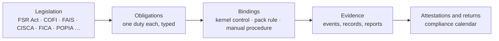

# 13. Legislation as a controlled, manco-managed layer

## The idea

> **Legislation is data the manco manages, under the same controls as money.**

On incumbent platforms the law lives in people's heads and in scattered settings. Nobody can answer "show me every FICA check applied in March" or "which rules change when COFI commences".

Here every Act, standard and notice is an **object** in the platform. Each one breaks down into **obligations**. Each obligation is **bound** to something that enforces it. Each binding produces **evidence**. The manco owns its register. Changes are versioned, approved and effective-dated.

## The model

| Object | Owned by | Contents |
|--------|----------|----------|
| **Legislation** | Platform library | Name, regulator, status (in force, pending, repealed), versions with effective dates, sources. |
| **Obligation** | Platform library | One duty. Reference. Who it applies to. What triggers it. Its type. Evidence required. Deadline. |
| **Binding** | Tenant register, **manco managed** | How this manco meets the obligation: a kernel control, a pack rule, a manual procedure, or a justified "not applicable". Owner role. |
| **Evidence** | Kernel, automatic | Events and records that prove the binding ran: gates passed, reports filed, attestations signed. |
| **Attestation** | Tenant register | Periodic sign-off for manual duties. Overdue is a break. |

## Two layers

**The platform legislation library.** Shared by every tenant. Kept current by the platform's regulatory team with AI monitoring of Gazette notices, FSCA and FIC communications and SARS notices. Every change is a new version with an effective date and a source. Two approvers.

**The tenant obligation register.** Owned by the manco's compliance function. It decides applicability, names owners, chooses bindings, records attestations, and adds licence-specific duties such as FSCA licence conditions and deed requirements.

| The manco can | The manco cannot |
|---------------|------------------|
| Add obligations from its licence conditions and deeds | Delete or edit a library obligation |
| Choose bindings among allowed implementations | Loosen a kernel-bound obligation |
| Mark an obligation not applicable, with a reason and approval | Mark it not applicable silently |
| Set owner roles and attestation cycles | Disable a gate |
| Tighten a deadline or add evidence | Backdate an effective date without approval |

## Controlled

The register is under the kernel's control model. The same rules as a payment.

| Control | How it applies to legislation |
|---------|-------------------------------|
| **Maker ≠ checker** | A compliance officer proposes. A key individual or head of compliance approves. Library changes need two platform approvers. |
| **Effective dating** | Every version has an effective-from date. Old versions stay readable and explain historical commands. |
| **Provenance** | Every obligation cites its source: Act, section, notice, Gazette number. |
| **Immutability** | Versions are never edited. A correction is a new version. |
| **Impact analysis** | A library change lists affected tenants, bound pack rules and kernel controls before it is approved. |
| **Regeneration** | Affected pack rules are regenerated and go through the normal pack gates. The new pack version is effective on commencement. |
| **Coverage gate** | A pack cannot be released while an applicable in-force obligation has no binding. |
| **Breaks** | An unbound obligation past commencement, an overdue return, or an overdue attestation is a break with an owner. |

## Highlighted

Legislation is visible wherever a decision is made.

- **Every pack rule carries `serves:`.** The rule names the obligations it meets. The review workspace shows a legislation badge on each rule and a coverage bar per Act.
- **Every kernel control lists the obligations it serves.** The controls catalogue in doc 05 gains a legislation column.
- **Every command records the obligations it evaluated.** A payment carries `obligation:FICA-CDD` and `obligation:FAIS-ADVISER-LICENCE` in its evidence. The **regulatory trail** query answers "every FICA gate applied in March".
- **A blocked action names the law.** "Blocked by FICA-CDD: verification expired on 2026-08-30."
- **Client documents cite disclosure obligations.** Confirmations and statements are rendered from templates that reference FAIS and COFI disclosure duties.
- **A compliance dashboard** shows coverage by Act, pending changes with countdowns, overdue returns and attestations due.

## Obligation types and how each binds

| Type | Meaning | Binds to | Example |
|------|---------|----------|---------|
| **Gate** | Must pass before a command proceeds | Kernel gate or pack guard | FICA due diligence current before a payment |
| **Limit** | A numeric constraint | Pack parameter with source and effective date | Regulation 28 limits, TFSA contribution limits, DWT rate |
| **Record** | What must be kept, for how long | Immutable events and retention hooks | FICA five-year records, FAIS records, POPIA retention |
| **Report** | A statutory return with a deadline | Compliance calendar and adapter | FSCA CIS statistics, FIC reports, IT3 submissions |
| **Disclosure** | What the client must be shown | Pack templates | FAIS General Code disclosures, MDD, effective annual cost |
| **Timing** | A deadline inside a process | Pack SLA, break on breach | Complaint acknowledgement, payment after redemption |
| **Attestation** | Periodic sign-off for a manual duty | Attestation workflow | RMCP review, staff training, board reporting |

## The South African map

Status and references are illustrative. The library holds the current, cited version. Verify against current law before release.

| Instrument | Regulator | Status | Governs on the platform | Bound mainly to | Manco owner |
|------------|-----------|--------|-------------------------|-----------------|-------------|
| **FSR Act** (Financial Sector Regulation Act, 2017) | FSCA, PA | In force | Twin Peaks licensing, conduct standards, complaints handling and the ombud system, fit and proper, statutory returns, information requests | Kernel audit trail and as-at reproducibility; pack complaints workflow and returns; governance attestations | Head of Compliance |
| **COFI** (Conduct of Financial Institutions Bill) | FSCA | Pending. Design for it now | Treating customers fairly outcomes in law, product governance and oversight, conduct risk and culture, disclosure and advice conduct, transformation | Pack product governance workflow, disclosure templates, complaint root cause; kernel evidence trail | Head of Compliance, Product Owner |
| **FAIS** (Financial Advisory and Intermediary Services Act, 2002) | FSCA | In force, to be absorbed by COFI | FSP licensing (a LISP as an administrative FSP), representatives and key individuals, General Code of Conduct, fee and conflict disclosure, records, FAIS Ombud | Kernel adviser party with licence status; **gate: no adviser fee released to an unlicensed or debarred FSP**; pack onboarding checks and disclosures | Key Individual |
| **CISCA** (Collective Investment Schemes Control Act, 2002) with Board Notices | FSCA | In force | Manco registration, deed and trustee, forward pricing, segregated trust money, permissible investments, advertising, ring-fencing, distributions, pricing errors, trustee and FSCA reporting | Kernel forward pricing, immutable prices, control accounts, unit register; pack deed rules, thresholds, materiality | Head of Operations, Compliance |
| **FICA** (Financial Intelligence Centre Act, 2001) | FIC | In force | Accountable institution duties: risk management and compliance programme, customer due diligence and enhanced due diligence, prominent persons and sanctions screening, record keeping, cash threshold and suspicious transaction reports, training | Kernel KYC gate on dealing and payment, large transaction flags; pack risk rating, document lists, report formats | Money Laundering Reporting Officer |
| **POPIA** (Protection of Personal Information Act, 2013) | Information Regulator | In force | Lawful processing, purpose limitation, retention, security safeguards, breach notification, operator agreements, cross-border transfers | Kernel tenant isolation, access logging, retention hooks; pack retention periods and consent | Information Officer |
| **Pension Funds Act** (1956) and two-pot amendments | FSCA | In force | Regulation 28 limits, section 14 transfers, two-pot components and withdrawals, retirement rules | Kernel components, restriction flags, transfer block; pack limits and ages | Product Owner (LISP) |
| **Income Tax Act** and **Tax Administration Act** | SARS | In force | IT3 certificates, dividends tax, interest withholding, tax-free savings, tax directives, capital gains, FATCA and CRS third-party reporting | Kernel tax lots and withholding postings; pack rates, methods and formats | Head of Tax |
| **Insurance Act** (2017) and policyholder protection rules | PA, FSCA | In force where products are life-wrapped | Endowments and living annuities issued through a linked insurer | Pack wrapper rules and disclosures | Product Owner |
| **Exchange Control Regulations** | SARB | In force | Foreign investment allowances, manco foreign capacity | Pack foreign class eligibility and capacity checks; kernel limits | Finance |
| **FSCA and PA Joint Standards** on IT governance and cybersecurity | FSCA, PA | In force | IT risk governance, incident reporting, cyber resilience | Platform security controls, incident process, attestations | Chief Information Officer |
| **ASISA Standards and Codes** | Self-regulatory | In force | Minimum disclosure document, cost disclosure, pricing errors, fund classification, unclaimed assets | Kernel correction block; pack materiality and templates | Compliance |
| **FSCA Conduct Standards and Board Notices** | FSCA | In force | Investment limits, advertising, fit and proper, specific conduct standards | Pack rules; kernel audit | Compliance |

## How a change flows

- Until the new pack is live the obligation shows as **pending binding** with a countdown.
- Past commencement without a binding it is a **break**.
- **COFI** is the standing example. Its obligations sit in the library today as pending. Every manco can see what will change for them before it commences.

## Kernel additions

| Addition | What it does |
|----------|--------------|
| **Obligation register** component | Holds the library and each tenant's register. Versioned, effective-dated, controlled. |
| **Coverage gate** in the pack validator | Every applicable in-force obligation is bound or justified. Otherwise no release. |
| **Obligation tags** on commands and journals | Kernel gates add their tags automatically. Pack guards declare `serves:`. |
| **Regulatory trail** query | Every command that evaluated an obligation in a period, with outcome and evidence. |
| **Compliance calendar** | Report and attestation obligations become dated items with owners. Overdue is a break. Month close gates on statutory returns. |
| **Legislation column** in the controls catalogue | Each kernel control lists the obligations it serves. |

## Pack additions

A pack gains a `regulatory/` folder.

| File | Contents |
|------|----------|
| `regulatory/obligations.yaml` | The tenant's bindings: obligation, applicability, owner, implementations, attestation cycle. |
| `regulatory/compliance-calendar.yaml` | Returns and attestations with deadlines and owners. |
| `serves:` on every rule | Workflows, policies and templates name the obligations they meet. |

The example pack shows both files.

## Worked examples

**FICA due diligence on a redemption payment.**
The obligation is a gate. It binds to the kernel's KYC check on payment and to the pack's held state for missing documents. A payment to an account whose verification expired is refused with the obligation named. The successful payment carries `obligation:FICA-CDD` in its evidence.

**FAIS adviser licence on fee release.**
The obligation is a gate. Adviser fees are payables. The kernel refuses release to an adviser whose FSP licence is lapsed or who is debarred. The fee stays payable, the break names the adviser and the obligation, and the monthly fee run report lists it.

**COFI disclosure on confirmations.**
The obligation is a disclosure, pending. The confirmation template already carries `serves: [COFI-DISCLOSURE, FAIS-GCOC-DISCLOSURE]`. On commencement only the status flips. The manco sees zero regeneration work because the binding exists today.

**FSR Act complaints handling.**
Timing and report obligations. The complaints workflow in the pack carries acknowledgement and resolution SLAs. Breaches are breaks. The conduct return draws its figures from the same events.

## AI's role

- **Extract** obligations from Acts, standards and notices into the library format, with citations.
- **Monitor** for changes and draft library versions with impact analysis.
- **Propose** bindings for a tenant from its pack and documents.
- **Flag** gaps and conflicts between the register and the pack.
- **Never** approve a library change, a binding or a not-applicable decision. People do that. Every suggestion is logged with its inputs.
